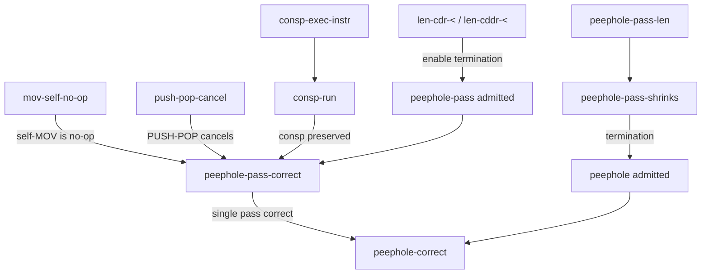

# Peephole Optimization Verification in ACL2 — Full Report

**Author:** Yoga Sri Varshan Varadharajan (yv2857)
**Source file:** [peephole.lisp](file:///Users/yogasrivarshanv/UT/R&I/peephole.lisp)

---

## Table of Contents

1. [Introduction: What This Project Does](#1-introduction-what-this-project-does)
2. [Background: ACL2 Primer](#2-background-acl2-primer)
3. [Phase 1: Language and Semantics](#3-phase-1-language-and-semantics)
   - 1.1 Machine State
   - 1.2 Instruction Set
   - 1.3 Operational Semantics
4. [Phase 2: The Peephole Optimizer](#4-phase-2-the-peephole-optimizer)
   - 2.1 Single-Pass Core (`peephole-pass`)
   - 2.2 Multi-Pass Fixpoint (`peephole`)
5. [Phase 3: Proof Infrastructure (Lemmas)](#5-phase-3-proof-infrastructure-lemmas)
   - 3.1 Termination Helpers
   - 3.2 Self-MOV No-Op Lemma
   - 3.3 PUSH-POP Cancellation Lemma
   - 3.4 State Shape Preservation
6. [Phase 4: The Main Correctness Theorem](#6-phase-4-the-main-correctness-theorem)
   - 4.1 Custom Induction Scheme
   - 4.2 Single-Pass Correctness
   - 4.3 Length Properties of the Single Pass
   - 4.4 Multi-Pass Fixpoint Definition
   - 4.5 Multi-Pass Correctness
7. [Phase 5: Tests](#7-phase-5-tests)
8. [Design Decisions and Hurdles](#8-design-decisions-and-hurdles)
9. [Complete Line-by-Line Code Walkthrough](#9-complete-line-by-line-code-walkthrough)

---

## 1. Introduction: What This Project Does

### The Big Picture

A **peephole optimizer** is a compiler optimization technique that examines a small "window" (or "peephole") of consecutive instructions and replaces inefficient patterns with more efficient ones. For example:

- Pushing a value onto a stack and immediately popping it off is pointless — the program ends up in the same state it started in.
- Copying a register into itself (`R1 := R1`) does nothing useful.

A peephole optimizer scans an instruction list, finds these patterns, and removes them. The resulting program is shorter and faster, but it must behave **identically** to the original.

Crucially, a single scan can reveal new patterns. For example, removing the inner pair from `(PUSH 1) (PUSH 2) (POP) (POP)` yields `(PUSH 1) (POP)` — a new PUSH-POP pair. Our optimizer therefore iterates its single-pass core to a **fixpoint**, guaranteeing that all cascading redundancies are eliminated.

### What We Prove

We formally prove, inside the ACL2 theorem prover, that our peephole optimizer is **correct**: for every possible instruction list and every possible machine state, running the optimized program produces the exact same final state as running the original program:

```
(implies (consp st)
         (equal (run (peephole instrs) st)
                (run instrs st)))
```

This is not a test — it is a **mathematical proof** that covers infinitely many inputs. ACL2 mechanically checks every step of the argument.

---

## 2. Background: ACL2 Primer

For readers unfamiliar with ACL2, here are the essential concepts needed to understand this project.

### 2.1 What is ACL2?

ACL2 (A Computational Logic for Applicative Common Lisp) is both a **programming language** (a subset of Common Lisp) and a **theorem prover**. You write functions in Lisp, state properties about them as theorems (`defthm`), and ACL2 attempts to prove those properties automatically.

### 2.2 Data in ACL2

ACL2 is built on two primitive data types:

| Type | Examples | Description |
|------|----------|-------------|
| **Atoms** | `nil`, `t`, `42`, `'PUSH`, `'R1` | Indivisible values: symbols, numbers, strings, characters |
| **Cons pairs** | `(cons 1 2)` = `(1 . 2)` | A pair of two values, built with `cons` |

Everything else is built from cons pairs. A **list** is a chain of cons pairs ending in `nil`:

```
(list 1 2 3)  =  (cons 1 (cons 2 (cons 3 nil)))  =  (1 2 3)
```

### 2.3 Key Built-in Functions

| Function | What it does | Example |
|----------|-------------|---------|
| `(cons a b)` | Build a pair | `(cons 1 2)` → `(1 . 2)` |
| `(car x)` | First element of a pair | `(car '(1 . 2))` → `1` |
| `(cdr x)` | Second element of a pair | `(cdr '(1 . 2))` → `2` |
| `(cadr x)` | Shorthand for `(car (cdr x))` | `(cadr '(A B C))` → `B` |
| `(caddr x)` | `(car (cdr (cdr x)))` | `(caddr '(A B C))` → `C` |
| `(consp x)` | Is `x` a cons pair? | `(consp '(1))` → `t` |
| `(endp x)` | Is `x` the end of a list? (atom) | `(endp nil)` → `t` |
| `(equal a b)` | Are `a` and `b` structurally identical? | `(equal 3 3)` → `t` |
| `(len x)` | Length of a list | `(len '(a b c))` → `3` |
| `(assoc-equal k alist)` | Look up key `k` in an association list | `(assoc-equal 'x '((x . 5)))` → `(x . 5)` |
| `(put-assoc-equal k v alist)` | Set key `k` to value `v` in an alist | Updates or adds the pair |

### 2.4 Defining Functions: `defun`

```lisp
(defun square (x)
  (* x x))
```

This defines a function `square` that takes one argument `x` and returns `x * x`. ACL2 requires that all functions **terminate** — they cannot loop forever. For recursive functions, ACL2 needs to see that some **measure** (a non-negative integer) strictly decreases on every recursive call.

### 2.5 Proving Theorems: `defthm`

```lisp
(defthm square-is-non-negative
  (implies (rationalp x)
           (<= 0 (square x))))
```

This tells ACL2: "prove that for any rational `x`, `(square x)` is non-negative." ACL2 will attempt the proof automatically using its built-in strategies (simplification, rewriting, induction, etc.). If it succeeds, it prints `Q.E.D.` and stores the theorem as a **rewrite rule** for future proofs.

### 2.6 Association Lists (Alists)

An alist is a list of key-value pairs, used like a dictionary:

```
((R1 . 5) (R2 . 10) (R3 . 0))
```

- `(assoc-equal 'R1 alist)` returns `(R1 . 5)` — the pair itself
- `(cdr (assoc-equal 'R1 alist))` returns `5` — just the value
- `(put-assoc-equal 'R1 99 alist)` returns `((R1 . 99) (R2 . 10) (R3 . 0))`

We use alists to represent the machine's register file.

### 2.7 The `declare` Form

```lisp
(declare (xargs :measure (len instrs)))
```

This tells ACL2 which **measure** to use for proving termination. Here, `(len instrs)` is the length of the instruction list. ACL2 needs to verify that this value decreases on every recursive call.

### 2.8 The `let` and `cond` Forms

`let` binds local variables:
```lisp
(let ((x 5)
      (y 10))
  (+ x y))    ; returns 15
```

`cond` is a multi-way conditional (like `if-else if-else`):
```lisp
(cond
  (test1 result1)
  (test2 result2)
  (t     default-result))
```

### 2.9 Rule Classes

When ACL2 proves a theorem, it stores it as a **rule** for future use. The rule class determines how:

| Rule class | How ACL2 uses it |
|-----------|-----------------|
| `:rewrite` (default) | Replaces left-hand side with right-hand side during simplification |
| `:linear` | Used in arithmetic reasoning (inequalities) |
| `:type-prescription` | Tells ACL2 about the return type of a function |

---

## 3. Phase 1: Language and Semantics

Before we can optimize anything or prove anything, we need to **define the machine** we are reasoning about. This means defining:
1. What a machine state looks like
2. What instructions are available
3. What each instruction does to the state

### 3.1 Machine State (Lines 29–36)

Our machine has two components:
- A **stack**: a last-in-first-out (LIFO) data structure for holding intermediate values
- A **register file**: a set of named storage locations

We represent the state as a **cons pair**: `(cons stack registers)`.

```lisp
(defun mk-state (stk regs)    ;; Line 29-30
  (cons stk regs))
```

**`mk-state`** is the **constructor**. Given a stack `stk` and registers `regs`, it builds a state by consing them together. For example:
```
(mk-state '(3 5) '((R1 . 10)))  →  ((3 5) . ((R1 . 10)))
                                      ↑ stack    ↑ registers
```

```lisp
(defun get-stack (s)            ;; Line 32-33
  (car s))
```

**`get-stack`** is an **accessor** that extracts the stack from a state. Since the state is `(cons stack regs)`, `(car state)` gives us the stack.

```lisp
(defun get-regs (s)             ;; Line 35-36
  (cdr s))
```

**`get-regs`** extracts the register file. `(cdr state)` gives us the registers.

> [!NOTE]
> We chose a cons pair over a list for simplicity. A list like `(list stack regs)` = `(cons stack (cons regs nil))` would waste an extra cons cell and add an extra `cdr` to access registers.

#### Why `consp` Matters

A critical detail: `(cons (car s) (cdr s))` equals `s` **only when `s` is a cons pair**. If `s` is an atom (like `nil`), then `(car nil) = nil` and `(cdr nil) = nil`, so `(cons nil nil)` ≠ `nil`. This is why the main theorem requires `(consp st)` — it ensures the state can be deconstructed and reconstructed identically.

---

### 3.2 Instruction Set (Lines 43–71)

We define four instructions. Each is encoded as a Lisp list, and each has a **recognizer predicate** (a function returning `t` or `nil`) that checks whether a given value is a valid instance of that instruction.

#### PUSH instruction (Lines 43–50)

```lisp
(defun push-instrp (instr)      ;; Recognizer
  (and (consp instr)             ;; It must be a cons pair (not an atom)
       (equal (car instr) 'PUSH) ;; First element is the symbol PUSH
       (consp (cdr instr))       ;; There is a second element (the value)
       (not (consp (cddr instr)))))  ;; There is NO third element
```

This recognizes lists of the form `(PUSH n)` where `n` is any value. The four conditions ensure:
1. `instr` is not an atom
2. The tag is `'PUSH`
3. There is at least one argument after the tag
4. There is exactly one argument (no more)

Examples:
- `(PUSH 5)` → `t` (valid)
- `(PUSH)` → `nil` (missing the value)
- `(PUSH 1 2)` → `nil` (too many arguments)
- `(POP)` → `nil` (wrong tag)

```lisp
(defun push-val (instr)         ;; Value extractor
  (cadr instr))                  ;; Second element of the list
```

**`push-val`** extracts the value to push. `(cadr '(PUSH 5))` = `(car (cdr '(PUSH 5)))` = `(car '(5))` = `5`.

#### POP instruction (Lines 53–56)

```lisp
(defun pop-instrp (instr)
  (and (consp instr)
       (equal (car instr) 'POP)
       (not (consp (cdr instr)))))
```

Recognizes `(POP)` — a one-element list. The third condition `(not (consp (cdr instr)))` ensures there are no arguments after `POP`.

#### ADD instruction (Lines 59–62)

```lisp
(defun add-instrp (instr)
  (and (consp instr)
       (equal (car instr) 'ADD)
       (not (consp (cdr instr)))))
```

Identical structure to `pop-instrp` but looks for the tag `'ADD`.

#### MOV instruction (Lines 66–71)

```lisp
(defun mov-instrp (instr)
  (and (consp instr)
       (equal (car instr) 'MOV)
       (consp (cdr instr))          ;; has at least a first register
       (consp (cddr instr))         ;; has at least a second register
       (not (consp (cdddr instr)))));; has exactly two registers
```

Recognizes `(MOV r1 r2)` — a three-element list. The semantics are: copy the value of register `r2` into register `r1`.

Examples:
- `(MOV R1 R2)` → `t` (copy R2 into R1)
- `(MOV R1 R1)` → `t` (self-assignment — this is what we optimize away)
- `(MOV R1)` → `nil` (missing destination/source)

---

### 3.3 Operational Semantics (Lines 78–126)

This is the heart of Phase 1: we define what each instruction **does** to the machine state.

#### Register Accessors (Lines 78–82)

```lisp
(defun get-reg (r regs)
  (cdr (assoc-equal r regs)))
```

Looks up register `r` in the alist `regs`. `assoc-equal` finds the pair `(r . value)`, and `cdr` extracts the value. If the register doesn't exist, `assoc-equal` returns `nil`, and `(cdr nil)` = `nil`.

```lisp
(defun set-reg (r v regs)
  (put-assoc-equal r v regs))
```

Sets register `r` to value `v`. `put-assoc-equal` either updates an existing pair or adds a new one.

#### Single-Instruction Evaluator: `exec-instr` (Lines 89–120)

```lisp
(defun exec-instr (instr s)
  (let ((stk  (get-stack s))      ;; Extract the stack
        (regs (get-regs s)))      ;; Extract the registers
    (cond ...)))
```

`exec-instr` takes one instruction and the current state, and returns the **new state** after executing that instruction. It destructures the state into `stk` (the stack) and `regs` (the registers), then uses a `cond` to dispatch on the instruction type.

**Case 1: PUSH** (Lines 94–95)
```lisp
((push-instrp instr)
 (mk-state (cons (push-val instr) stk) regs))
```

Push the value onto the stack. The new stack is `(cons value old-stack)`. Registers are unchanged.

Example trace:
```
State:  stack = (10 20),  regs = ((R1 . 5))
Instr:  (PUSH 99)
Result: stack = (99 10 20), regs = ((R1 . 5))
```

**Case 2: POP** (Lines 98–101)
```lisp
((pop-instrp instr)
 (if (consp stk)
     (mk-state (cdr stk) regs)
   s))
```

If the stack is non-empty (`consp stk`), remove the top element with `(cdr stk)`. If the stack is empty, do nothing (return `s` unchanged). This safety check prevents errors on empty stacks.

Example trace:
```
State:  stack = (99 10 20), regs = ...
Instr:  (POP)
Result: stack = (10 20),    regs = ...  (99 was removed)
```

**Case 3: ADD** (Lines 104–109)
```lisp
((add-instrp instr)
 (if (and (consp stk) (consp (cdr stk)))
     (mk-state (cons (+ (car stk) (cadr stk))
                     (cddr stk))
               regs)
   s))
```

ADD pops the top **two** elements, adds them, and pushes the result. It needs at least two elements on the stack.

- `(car stk)` = first element (top of stack)
- `(cadr stk)` = second element
- `(+ ...)` = their sum
- `(cddr stk)` = the rest of the stack (without the top two)
- The result is `(cons sum rest-of-stack)`

Example trace:
```
State:  stack = (3 7 100), regs = ...
Instr:  (ADD)
Result: stack = (10 100),  regs = ...  (3 + 7 = 10)
```

**Case 4: MOV** (Lines 112–117)
```lisp
((mov-instrp instr)
 (let ((r1 (cadr instr))       ;; destination register
       (r2 (caddr instr)))     ;; source register
   (if (equal r1 r2)
       s                       ;; SELF-MOV: do nothing!
     (mk-state stk (set-reg r1 (get-reg r2 regs) regs)))))
```

This is a **critical design decision**. When `r1 = r2` (self-assignment like `(MOV R1 R1)`), we return `s` unchanged. When `r1 ≠ r2`, we read the value of `r2` and write it into `r1`.

> [!IMPORTANT]
> **Why the self-MOV special case?** Without it, `(MOV R1 R1)` would execute `(set-reg R1 (get-reg R1 regs) regs)`, which calls `(put-assoc-equal R1 value regs)`. If `R1` is already in the alist, this is fine — it writes back the same value. But if `R1` is **not** in the alist, `put-assoc-equal` **adds** a new entry `(R1 . nil)`, changing the alist structure. The state would be structurally different from the original, even though it's "logically" the same. By explicitly returning `s` for self-MOV, we guarantee `(exec-instr (MOV r r) s)` = `s` unconditionally, which makes the optimizer proof clean.

**Case 5: Unknown instruction** (Lines 119–120)
```lisp
(t s)
```

Any unrecognized instruction is a no-op — the state is returned unchanged.

#### Multi-Instruction Evaluator: `run` (Lines 123–126)

```lisp
(defun run (instrs s)
  (if (endp instrs)          ;; No more instructions?
      s                       ;; Return the final state
    (run (cdr instrs)         ;; Recurse on remaining instructions
         (exec-instr (car instrs) s))))  ;; After executing the first one
```

`run` takes a list of instructions and executes them one by one, left to right. It is defined recursively:

- **Base case**: if the instruction list is empty (`endp instrs`), return the current state `s`.
- **Recursive case**: execute the first instruction (`car instrs`) to get a new state, then run the remaining instructions (`cdr instrs`) on that new state.

ACL2 automatically proves termination because `(cdr instrs)` is strictly smaller than `instrs` (by `acl2-count`).

Full example trace:
```
(run '((PUSH 3) (PUSH 7) (ADD)) '(nil . nil))

Step 1: exec-instr (PUSH 3) on (nil . nil)  →  ((3) . nil)
Step 2: exec-instr (PUSH 7) on ((3) . nil)  →  ((7 3) . nil)
Step 3: exec-instr (ADD)    on ((7 3) . nil) →  ((10) . nil)
Result: ((10) . nil)    ;; stack = (10), regs = nil
```

---

## 4. Phase 2: The Peephole Optimizer

### 4.1 What the Optimizer Does

The optimizer scans an instruction list and removes two kinds of redundant patterns:

| Pattern | Example | Action |
|---------|---------|--------|
| **PUSH-POP** | `(PUSH 3) (POP)` | Remove both instructions |
| **Self-MOV** | `(MOV R1 R1)` | Remove the instruction |

The optimizer is structured in two layers:

1. **`peephole-pass`** — a single left-to-right scan that eliminates all directly visible patterns.
2. **`peephole`** — iterates `peephole-pass` to a fixpoint, catching patterns that only emerge after a prior elimination.

### 4.2 The Single-Pass Core: `peephole-pass` (Lines 143–169)

```lisp
(defun peephole-pass (instrs)
  (declare (xargs :measure (len instrs)))
```

The function is named `peephole-pass` (not `optimize`) because ACL2 reserves `OPTIMIZE` as a Common Lisp symbol that cannot be redefined.

The `declare` form tells ACL2 to use `(len instrs)` — the length of the instruction list — as the termination measure. ACL2 must verify that this value decreases on every recursive call.

#### Base case (Lines 145–146)

```lisp
  (if (endp instrs)
      nil
```

If the instruction list is empty, return the empty list `nil` (no instructions to output).

#### One instruction left (Lines 147–154)

```lisp
    (let ((i1   (car instrs))
          (rest (cdr instrs)))
      (if (endp rest)
          (if (and (mov-instrp i1)
                   (equal (cadr i1) (caddr i1)))
              (peephole-pass rest)
            (cons i1 (peephole-pass rest)))
```

When there's exactly one instruction left (`(endp rest)` is true):
- If it's a self-MOV (`(MOV r r)` where `r1 = r2`): skip it, recurse on `rest` (which is `nil`)
- Otherwise: keep it by consing `i1` onto the optimized tail

The measure decreases: `(len rest) = (len instrs) - 1 < (len instrs)`.

#### Two or more instructions (Lines 155–169)

```lisp
        (let ((i2    (car rest))
              (rest2 (cdr rest)))
```

We look at the first two instructions `i1` and `i2`, and the remaining list `rest2`.

**Pattern 1: PUSH-POP elimination** (Lines 158–161)
```lisp
          (if (and (push-instrp i1)
                   (pop-instrp i2))
              (peephole-pass rest2)
```

If `i1` is a PUSH and `i2` is a POP, skip both and recurse on `rest2` (the instructions after the POP). The measure decreases by 2: `(len rest2) = (len instrs) - 2 < (len instrs)`.

**Pattern 2: Self-MOV elimination** (Lines 163–166)
```lisp
            (if (and (mov-instrp i1)
                     (equal (cadr i1) (caddr i1)))
                (peephole-pass rest)
```

If `i1` is a self-MOV, skip it and recurse on `rest`. Measure decreases by 1.

**Default: No pattern matched** (Lines 168–169)
```lisp
              (cons i1 (peephole-pass rest)))))))))
```

Keep `i1` in the output and recurse on `rest` to optimize the remaining instructions.

### 4.3 Single-Pass Trace Example

```
Input:  ((MOV R1 R1) (PUSH 10) (POP) (PUSH 42))

Step 1: i1 = (MOV R1 R1)  →  self-MOV! Drop it.
        Recurse on ((PUSH 10) (POP) (PUSH 42))

Step 2: i1 = (PUSH 10), i2 = (POP)  →  PUSH-POP! Drop both.
        Recurse on ((PUSH 42))

Step 3: i1 = (PUSH 42), rest = ()  →  one instr, not self-MOV, keep it.
        Return ((PUSH 42))

Output: ((PUSH 42))
```

Four instructions became one. The single pass removed three redundant instructions.

### 4.4 Single-Pass Termination

ACL2 needs to verify that `(len instrs)` strictly decreases on every recursive call:

| Branch | Recursive argument | Length | Decrease |
|--------|-------------------|--------|----------|
| Self-MOV (one left) | `rest` = `(cdr instrs)` | `n - 1` | By 1 |
| Keep (one left) | `rest` = `(cdr instrs)` | `n - 1` | By 1 |
| PUSH-POP | `rest2` = `(cddr instrs)` | `n - 2` | By 2 |
| Self-MOV (many) | `rest` = `(cdr instrs)` | `n - 1` | By 1 |
| Default | `rest` = `(cdr instrs)` | `n - 1` | By 1 |

All cases decrease, so the function always terminates. ACL2 verifies this automatically.

### 4.5 The Multi-Pass Fixpoint: `peephole` (Lines 296–301)

A single pass can miss **cascading patterns** — redundancies that only appear after a prior elimination. For example:

```
Input:          ((PUSH 1) (PUSH 2) (POP) (POP))

Pass 1:
  i1 = (PUSH 1), i2 = (PUSH 2) → no match, keep (PUSH 1)
  i1 = (PUSH 2), i2 = (POP)    → PUSH-POP! Drop both.
  i1 = (POP)                    → keep.
  Result: ((PUSH 1) (POP))         ← new PUSH-POP pair!

Pass 2:
  i1 = (PUSH 1), i2 = (POP)    → PUSH-POP! Drop both.
  Result: nil                       ← fully optimized

Pass 3:
  (peephole-pass nil) = nil = input → fixpoint reached, stop.
```

The fixpoint wrapper iterates `peephole-pass` until the output equals the input:

```lisp
(defun peephole (instrs)
  (declare (xargs :measure (len instrs)))
  (let ((result (peephole-pass instrs)))
    (if (equal result instrs)
        result
      (peephole result))))
```

**Termination**: Each productive pass (one that changes something) strictly shrinks the instruction list. Since the list length is a natural number bounded below by 0, the iteration must eventually reach a fixpoint. This is formalized via two lemmas proved in Phase 4 (Section 6.3):

- `peephole-pass-len`: a single pass never increases length (`≤`)
- `peephole-pass-shrinks-when-changed`: when it changes something, length strictly decreases (`<`)

---

## 5. Phase 3: Proof Infrastructure (Lemmas)

The correctness theorems cannot be proved directly. ACL2 needs intermediate facts — **lemmas** — that break the proof into manageable pieces.

### 5.1 Termination Helpers (Lines 182–190)

```lisp
(defthm len-cdr-<
  (implies (consp x)
           (< (len (cdr x)) (len x)))
  :rule-classes :linear)
```

**What it says**: If `x` is a cons pair, then the length of `(cdr x)` is strictly less than the length of `x`.

**Why we need it**: ACL2 uses `:linear` rules when reasoning about arithmetic inequalities. This helps it conclude that recursive calls on `(cdr instrs)` decrease the measure.

**How the proof works**: By the definition of `len`:
```
(len x) = (if (consp x) (+ 1 (len (cdr x))) 0)
```
When `(consp x)`: `(len x) = 1 + (len (cdr x))`, so `(len (cdr x)) = (len x) - 1 < (len x)`. ∎

```lisp
(defthm len-cddr-<
  (implies (and (consp x) (consp (cdr x)))
           (< (len (cddr x)) (len x)))
  :rule-classes :linear)
```

**What it says**: If `x` has at least two elements, then `(len (cddr x)) < (len x)`.

**Why we need it**: The PUSH-POP branch recurses on `(cddr instrs)`, skipping two elements. This lemma tells ACL2 the measure decreases by at least 2.

**Proof sketch**: `(len x) ≥ 2`, `(len (cddr x)) = (len x) - 2`, so `(len (cddr x)) < (len x)`. ∎

### 5.2 Frame Lemma: Self-MOV is a No-Op (Lines 197–199)

```lisp
(defthm mov-self-no-op
  (implies (equal r1 r2)
           (equal (exec-instr (list 'MOV r1 r2) s) s)))
```

**What it says**: Executing a MOV instruction where the source and destination are the same register returns the state unchanged.

**Why we need it**: When the optimizer removes a `(MOV r r)`, it claims the instruction was pointless. This lemma confirms that claim at the semantic level.

**How the proof works**: ACL2 expands `exec-instr` with the instruction `(list 'MOV r1 r2)`:
1. `(mov-instrp (list 'MOV r1 r2))` evaluates to `t` (it's a valid MOV)
2. `(cadr ...)` = `r1`, `(caddr ...)` = `r2`
3. Since `r1 = r2`, the `(if (equal r1 r2) s ...)` branch returns `s`

Result: `(exec-instr (list 'MOV r1 r2) s) = s`. ∎

### 5.3 Step Equivalence: PUSH-POP Cancellation (Lines 214–217)

```lisp
(defthm push-pop-cancel
  (implies (consp s)
           (equal (exec-instr '(POP) (exec-instr (list 'PUSH n) s))
                  s)))
```

**What it says**: If you PUSH a value and then immediately POP, you get back the original state (provided the state is a cons pair).

**Why we need it**: This is the semantic justification for the PUSH-POP elimination optimization.

**Detailed proof trace**:

Let `s` be a state where `(consp s)`, so `s = (cons stk regs)` for some `stk` and `regs`.

Step 1 — Execute `(PUSH n)`:
```
(exec-instr (list 'PUSH n) s)
= (mk-state (cons n stk) regs)     ;; push n onto the stack
= (cons (cons n stk) regs)          ;; expand mk-state
```

Step 2 — Execute `(POP)` on the result:
```
(exec-instr '(POP) (cons (cons n stk) regs))
```
The stack of this new state is `(car (cons (cons n stk) regs))` = `(cons n stk)`, which IS a cons pair, so:
```
= (mk-state (cdr (cons n stk)) regs)
= (mk-state stk regs)
= (cons stk regs)
= s                                  ;; because (consp s) ⇒ (cons (car s) (cdr s)) = s
```

Result: `(exec-instr '(POP) (exec-instr (list 'PUSH n) s)) = s`. ∎

> [!IMPORTANT]
> **The `(consp s)` hypothesis is essential.** If `s = nil`, then `stk = (car nil) = nil` and `regs = (cdr nil) = nil`. After PUSH and POP, we get `(cons nil nil)`, which is NOT equal to `nil`. The theorem would be false without the hypothesis.

### 5.4 State Shape Preservation (Lines 223–229)

```lisp
(defthm consp-exec-instr
  (implies (consp s)
           (consp (exec-instr instr s))))
```

**What it says**: If the state is a cons pair before executing an instruction, it is still a cons pair afterward.

**Why we need it**: The main theorem requires `(consp st)`. We need to know this invariant is preserved as `run` executes each instruction, so the hypothesis carries through the entire execution.

**Proof**: Each branch of `exec-instr` either returns `(mk-state ...)` = `(cons ...)` (which is always a cons pair), or returns `s` unchanged (which is a cons pair by hypothesis). ACL2 deduces this from the type-prescription of `exec-instr`. ∎

```lisp
(defthm consp-run
  (implies (consp s)
           (consp (run instrs s))))
```

**What it says**: Running any instruction list on a cons-pair state produces a cons-pair result.

**Proof**: By induction on the instruction list, using `consp-exec-instr` at each step. ∎

---

## 6. Phase 4: The Main Correctness Theorem

The proof proceeds in two tiers:

1. **Single-pass correctness**: prove that one application of `peephole-pass` preserves semantics.
2. **Multi-pass correctness**: prove that iterating to a fixpoint also preserves semantics (follows from tier 1).

Between them we prove length properties that justify the fixpoint's termination.

### 6.1 Why We Need a Custom Induction Scheme

ACL2 proves theorems about recursive functions using **induction**. Normally, ACL2 chooses an induction scheme based on the functions in the theorem. But the single-pass theorem mentions **two** recursive functions — `peephole-pass` and `run` — which recurse **differently**:

| Function | How it recurses |
|----------|----------------|
| `run` | Always steps by one: `(cdr instrs)` |
| `peephole-pass` | Sometimes steps by one: `(cdr instrs)`, sometimes by two: `(cddr instrs)` |

ACL2 cannot automatically reconcile these two recursion patterns. If it inducts following `run`, it steps one instruction at a time and cannot handle the PUSH-POP case (which skips two). If it inducts following `peephole-pass`, it doesn't know how `run` behaves.

The solution is a **custom induction function** that combines both patterns: it case-splits exactly like `peephole-pass`, but also threads the machine state through like `run`.

### 6.2 The Induction Function: `peephole-pass-induct` (Lines 241–261)

```lisp
(defun peephole-pass-induct (instrs st)
  (declare (xargs :measure (len instrs)))
  (if (endp instrs)
      st
    (let ((i1   (car instrs))
          (rest (cdr instrs)))
      (if (endp rest)
          (if (and (mov-instrp i1) (equal (cadr i1) (caddr i1)))
              (peephole-pass-induct rest st)
            (peephole-pass-induct rest (exec-instr i1 st)))
        (let ((i2    (car rest))
              (rest2 (cdr rest)))
          (if (and (push-instrp i1) (pop-instrp i2))
              (peephole-pass-induct rest2 st)
            (if (and (mov-instrp i1) (equal (cadr i1) (caddr i1)))
                (peephole-pass-induct rest st)
              (peephole-pass-induct rest (exec-instr i1 st)))))))))
```

This function does not compute anything useful — its return value is irrelevant. Its purpose is to tell ACL2 **how to induct**. The recursion structure generates the following induction cases:

| Case | Condition | Recursive call | What it means |
|------|-----------|----------------|--------------|
| Base | `(endp instrs)` | None | Empty program — trivial |
| 1 instr, self-MOV | `(endp rest)` ∧ self-MOV | `(rest, st)` | Skip the MOV, don't step state |
| 1 instr, other | `(endp rest)` ∧ ¬self-MOV | `(rest, exec-instr i1 st)` | Keep instr, step state |
| 2+ instrs, PUSH-POP | PUSH-POP match | `(rest2, st)` | Skip 2 instrs, don't step state |
| 2+ instrs, self-MOV | Self-MOV match | `(rest, st)` | Skip 1 instr, don't step state |
| 2+ instrs, default | No match | `(rest, exec-instr i1 st)` | Keep instr, step state |

The key insight is how the `st` parameter is handled:
- When the optimizer **drops** an instruction (self-MOV, PUSH-POP), the state is passed through **unchanged** — because the dropped instruction was a no-op.
- When the optimizer **keeps** an instruction, the state is **stepped** with `(exec-instr i1 st)` — mirroring what `run` does.

### 6.3 Single-Pass Correctness: `peephole-pass-correct` (Lines 267–271)

```lisp
(defthm peephole-pass-correct
  (implies (consp st)
           (equal (run (peephole-pass instrs) st)
                  (run instrs st)))
  :hints (("Goal" :induct (peephole-pass-induct instrs st))))
```

**What it says**: For any instruction list `instrs` and any cons-pair state `st`, running the single-pass-optimized program produces the same result as running the original program.

**The `:hints` directive**: Tells ACL2 to use our custom induction scheme `(peephole-pass-induct instrs st)` instead of trying to guess one.

**Proof overview by case**:

**Case 1: Empty program** (`(endp instrs)`)
```
LHS: (run (peephole-pass nil) st) = (run nil st) = st
RHS: (run nil st) = st
LHS = RHS ✓
```

**Case 2: Self-MOV, one instruction** (`instrs = ((MOV r r))`)
```
LHS: (run (peephole-pass '((MOV r r))) st)
   = (run nil st)                          [peephole-pass drops self-MOV]
   = st

RHS: (run '((MOV r r)) st)
   = (run nil (exec-instr '(MOV r r) st))  [run unfolds]
   = (exec-instr '(MOV r r) st)
   = st                                    [by mov-self-no-op]

LHS = RHS ✓
```

**Case 3: PUSH-POP pattern** (`instrs = ((PUSH n) (POP) . rest2)`)
```
LHS: (run (peephole-pass instrs) st)
   = (run (peephole-pass rest2) st)        [peephole-pass drops both]
   = (run rest2 st)                        [by induction hypothesis]

RHS: (run instrs st)
   = (run rest2 (exec-instr '(POP) (exec-instr '(PUSH n) st)))  [run unfolds twice]
   = (run rest2 st)                        [by push-pop-cancel, since (consp st)]

LHS = RHS ✓
```

**Case 4: Default** (`instrs = (i1 . rest)`, no pattern matches)
```
LHS: (run (peephole-pass instrs) st)
   = (run (cons i1 (peephole-pass rest)) st)    [peephole-pass keeps i1]
   = (run (peephole-pass rest) (exec-instr i1 st))  [run unfolds]
   = (run rest (exec-instr i1 st))               [by induction hypothesis]

RHS: (run instrs st)
   = (run rest (exec-instr i1 st))               [run unfolds]

LHS = RHS ✓
```

In every case, the induction hypothesis plus the lemmas bridge the gap. ACL2 verifies all of this automatically and reports **Q.E.D.**

### 6.4 Length Properties of `peephole-pass` (Lines 280–287)

Before we can define the multi-pass fixpoint, ACL2 needs to know that iteration terminates. We prove two facts:

```lisp
(defthm peephole-pass-len
  (<= (len (peephole-pass instrs)) (len instrs))
  :rule-classes :linear)
```

**What it says**: A single pass never makes the program longer. This is clear from the recursion: every branch either drops instructions or keeps exactly one.

```lisp
(defthm peephole-pass-shrinks-when-changed
  (implies (not (equal (peephole-pass instrs) instrs))
           (< (len (peephole-pass instrs)) (len instrs)))
  :rule-classes :linear)
```

**What it says**: If the output differs from the input, the output is strictly shorter. Intuitively: if `peephole-pass` didn't change anything, it returned the same list; if it did change something, at least one instruction was removed, shrinking the list.

**Why both lemmas?** The non-strict `≤` is needed as a stepping stone for the strict `<`. In the default branch of `peephole-pass`, we keep one instruction and recurse. The output length is `1 + (len (peephole-pass rest))`. By the `≤` lemma, `(len (peephole-pass rest)) ≤ (len rest)`, so the output length `≤ 1 + (len rest) = (len instrs)`. In the non-default branches (PUSH-POP, self-MOV), at least one instruction is dropped, so the output is strictly shorter. ACL2 uses the `:linear` rule class to chain these inequalities during the strict-decrease proof.

Together, these two lemmas tell ACL2 that `(len instrs)` is a valid termination measure for the fixpoint: each iteration that makes progress reduces the measure by at least 1, and the measure cannot go below 0.

### 6.5 Multi-Pass Correctness: `peephole-correct` (Lines 307–310)

```lisp
(defthm peephole-correct
  (implies (consp st)
           (equal (run (peephole instrs) st)
                  (run instrs st))))
```

**What it says**: For any instruction list `instrs` and any cons-pair state `st`, running the fully-optimized (fixpoint) program produces the same result as running the original program.

**Proof**: By induction on `peephole`'s recursion (measure = `(len instrs)`):

- **Base case**: `(peephole-pass instrs) = instrs` (fixpoint reached). Then `(peephole instrs) = instrs`, so both sides are `(run instrs st)`. ✓

- **Inductive case**: `(peephole-pass instrs) ≠ instrs`. Then `(peephole instrs) = (peephole (peephole-pass instrs))`.

```
(run (peephole instrs) st)
= (run (peephole (peephole-pass instrs)) st)    [by def. of peephole]
= (run (peephole-pass instrs) st)               [by induction hypothesis]
= (run instrs st)                               [by peephole-pass-correct]
```

The IH applies because `(len (peephole-pass instrs)) < (len instrs)` (by `peephole-pass-shrinks-when-changed`). The final step uses `peephole-pass-correct` as a rewrite rule. ✓

ACL2 discovers this proof automatically — no additional induction hints are needed beyond the natural recursion of `peephole`.

---

## 7. Phase 5: Tests

### 7.1 Test State (Line 317)

```lisp
(defconst *s0* (cons nil nil))
```

Defines a constant `*s0*` — an initial state with an empty stack and no registers. `(cons nil nil)` satisfies `(consp *s0*)`.

### 7.2 Optimizer Output Tests (Lines 321–369)

These tests verify that the `peephole` function produces the expected optimized instruction list:

| Test | Input | Expected Output | What it checks |
|------|-------|-----------------|----------------|
| 1 | `((PUSH 3) (POP) (PUSH 5))` | `((PUSH 5))` | PUSH-POP pair removed |
| 2 | `((MOV R1 R1) (PUSH 7))` | `((PUSH 7))` | Self-MOV removed |
| 3 | `((MOV R1 R1) (PUSH 10) (POP) (PUSH 42))` | `((PUSH 42))` | Both patterns combined |
| 4 | `((PUSH 1) (PUSH 2) (ADD) (MOV R1 R2))` | Same as input | No redundancy detected |
| 5 | `nil` | `nil` | Empty program unchanged |
| 6 | `((PUSH 1) (PUSH 2) (POP) (POP))` | `nil` | Cascading: fixpoint catches both layers |
| 7 | `((MOV R1 R1) (MOV R2 R2) (MOV R3 R3))` | `nil` | Multiple consecutive self-MOVs removed |
| 8 | `((PUSH 1) (PUSH 2) (ADD) (PUSH 99) (POP))` | `((PUSH 1) (PUSH 2) (ADD))` | Trailing PUSH-POP removed |
| 9 | `((MOV X X))` | `nil` | Single self-MOV removed |
| 10 | `((MOV R1 R2))` | `((MOV R1 R2))` | Non-self MOV preserved |

Test 6 is particularly important — it demonstrates the multi-pass fixpoint in action. A single pass would yield `((PUSH 1) (POP))`, but the fixpoint catches the revealed pair and reduces to `nil`.

Each uses `assert-event`, which is an ACL2 form that **halts loading** if the expression evaluates to `nil`. All returned `:PASSED`.

### 7.3 Semantic Correctness Tests (Lines 373–399)

These tests verify the **main theorem on concrete inputs** — that running the optimized program gives the same result as the original:

| Test | Program |
|------|---------|
| 11 | `(PUSH 3) (POP) (PUSH 5)` |
| 12 | `(MOV R1 R1) (PUSH 7)` |
| 13 | `(PUSH 1) (PUSH 2) (ADD) (MOV R1 R1) (PUSH 10) (POP)` |
| 14 | `(PUSH 5) (PUSH 5) (ADD) (PUSH 3) (POP) (MOV X X) (PUSH 7)` |

Each test executes:
```lisp
(equal (run (peephole program) *s0*)
       (run program *s0*))
```

These are redundant given the universal theorem `peephole-correct`, but they serve as concrete sanity checks and demonstrate the optimizer on real programs.

---

## 8. Design Decisions and Hurdles

### 8.1 Naming Constraints

| Intended Name | Problem | Actual Name |
|---------------|---------|-------------|
| `optimize` | Reserved in Common Lisp package — ACL2 refuses to define it | `peephole-pass` / `peephole` |
| `state` | Reserved by ACL2 for its internal state object — requires `set-state-ok` | `st` |
| `step` | Could shadow ACL2's proof-builder command | `exec-instr` |

### 8.2 The `(consp st)` Hypothesis

The main theorem requires `(consp st)`. This arises because our state representation is `(cons stack regs)`, and the identity `(cons (car s) (cdr s)) = s` only holds for cons pairs. Without it, the PUSH-POP cancellation lemma fails:

```
s = nil
After (PUSH 3): state = (cons (cons 3 nil) nil) = ((3))
After (POP):    state = (cons nil nil)
But (cons nil nil) ≠ nil
```

This hypothesis is standard practice in ACL2 machine models and is not restrictive — any real program starts with a proper state.

### 8.3 Self-MOV Semantics

We made `exec-instr` explicitly return `s` when `r1 = r2` in the MOV case. An alternative approach would define MOV uniformly as `(set-reg r1 (get-reg r2 regs) regs)` always, and prove that this is a no-op when `r1 = r2` and the register exists. However, this requires a hypothesis about register existence (`(assoc-equal r regs)`) because:

- If `r` is NOT in the alist: `(get-reg r regs)` returns `nil`
- `(set-reg r nil regs)` adds `(r . nil)` to the alist
- The alist now has a new entry — it is structurally different from the original

By handling self-MOV explicitly in the semantics, we avoid this complication entirely.

### 8.4 Proof Structure: Why Lemmas Matter

Without the lemma infrastructure, ACL2 would likely fail on the main theorems. The lemmas serve as **stepping stones**:



Each lemma is proved independently and then used as a rewrite rule in the next proof. This "lemma stacking" pattern is fundamental to ACL2 theorem proving.

### 8.5 Custom Induction: The Core Difficulty

The hardest part of this project is designing `peephole-pass-induct`. The key insight is:

1. The **case structure** must mirror `peephole-pass` exactly — same conditions, same branches
2. The **state threading** must mirror `run` — stepping the state when an instruction is kept, leaving it unchanged when an instruction is dropped
3. The **measure** must decrease in every branch — same as `peephole-pass`

If any of these three properties is wrong, the proof fails. Getting this right is the main intellectual contribution of the project.

### 8.6 Multi-Pass vs. Single-Pass Design

A single-pass optimizer is simpler to define and prove correct. However, it misses cascading patterns — redundancies that only appear after a prior elimination. For example, `((PUSH 1) (PUSH 2) (POP) (POP))` would reduce to `((PUSH 1) (POP))` in one pass, leaving a PUSH-POP pair behind.

The multi-pass fixpoint catches all such cascading patterns by iterating the single pass until the output stabilizes. The cost is two additional lemmas (`peephole-pass-len` and `peephole-pass-shrinks-when-changed`) needed to prove that the fixpoint terminates. However, the fixpoint correctness proof itself is almost trivial — it follows directly from `peephole-pass-correct` by induction on the number of iterations.

---

## 9. Complete Line-by-Line Code Walkthrough

Below is the entire source file with every line explained.

### Lines 1–16: Header Comment

```lisp
;; ============================================================
;; Peephole Optimization Verification in ACL2
;; Yoga Sri Varshan Varadharajan — yv2857
;; ============================================================
```

Standard header identifying the project and author.

```lisp
;; Optimizations:
;;   1. PUSH-POP elimination:  (PUSH n) (POP)  → ε
;;   2. Self-MOV elimination:  (MOV r r)        → ε
```

Documents the two optimization patterns. The `ε` symbol represents the empty sequence (both instructions are removed).

```lisp
;; Main theorem:
;;   (implies (consp st)
;;            (equal (run (peephole instrs) st)
;;                   (run instrs st)))
```

States the correctness guarantee: the optimizer preserves program semantics.

---

### Lines 29–36: State Representation

```lisp
(defun mk-state (stk regs)   ;; Constructor: build a state from stack + registers
  (cons stk regs))            ;; Represented as a cons pair

(defun get-stack (s)          ;; Accessor: extract the stack
  (car s))                    ;; car of (cons stack regs) = stack

(defun get-regs (s)           ;; Accessor: extract the registers
  (cdr s))                    ;; cdr of (cons stack regs) = regs
```

Three simple functions: one constructor, two accessors. They form an **abstraction barrier** — the rest of the code uses these functions instead of raw `car`/`cdr`, making the representation easy to change later.

---

### Lines 43–71: Instruction Recognizers

Each recognizer checks: (1) is it a list? (2) is the tag correct? (3) does it have the right number of arguments?

```lisp
;; PUSH: exactly 2 elements — (PUSH value)
(defun push-instrp (instr)
  (and (consp instr)                    ;; not an atom
       (equal (car instr) 'PUSH)        ;; tag is PUSH
       (consp (cdr instr))              ;; has ≥1 argument
       (not (consp (cddr instr)))))     ;; has exactly 1 argument

(defun push-val (instr)                 ;; extract the value
  (cadr instr))

;; POP: exactly 1 element — (POP)
(defun pop-instrp (instr)
  (and (consp instr)
       (equal (car instr) 'POP)
       (not (consp (cdr instr)))))      ;; no arguments

;; ADD: exactly 1 element — (ADD)
(defun add-instrp (instr)
  (and (consp instr)
       (equal (car instr) 'ADD)
       (not (consp (cdr instr)))))

;; MOV: exactly 3 elements — (MOV dest src)
(defun mov-instrp (instr)
  (and (consp instr)
       (equal (car instr) 'MOV)
       (consp (cdr instr))              ;; has ≥1 argument (dest)
       (consp (cddr instr))             ;; has ≥2 arguments (src)
       (not (consp (cdddr instr)))))    ;; has exactly 2 arguments
```

---

### Lines 78–82: Register Operations

```lisp
(defun get-reg (r regs)
  (cdr (assoc-equal r regs)))           ;; look up r, return its value (or nil)

(defun set-reg (r v regs)
  (put-assoc-equal r v regs))           ;; set r to v in the alist
```

`assoc-equal` does a linear search through the alist. `put-assoc-equal` replaces the existing pair or appends a new one.

---

### Lines 89–126: Instruction Execution and Program Running

Covered in detail in [Section 3.3](#33-operational-semantics-lines-78126). The key points:

- `exec-instr` dispatches on instruction type using `cond`
- Each case builds a new state with `mk-state` or returns `s` unchanged
- Self-MOV is handled as a special case returning `s`
- `run` processes instructions left-to-right by recurring on `(cdr instrs)`

---

### Lines 143–169: The Single-Pass Core (`peephole-pass`)

Covered in detail in [Section 4.2](#42-the-single-pass-core-peephole-pass-lines-143169). The key points:

- Looks at 1 or 2 instructions at a time
- Three recursive branches: PUSH-POP (skip 2), self-MOV (skip 1), default (keep 1)
- Returns a new instruction list with directly visible redundancies removed

---

### Lines 182–229: Lemmas

Six lemmas forming the proof infrastructure:

| Lines | Name | Purpose |
|-------|------|---------|
| 182–185 | `len-cdr-<` | `(len (cdr x)) < (len x)` for termination reasoning |
| 187–190 | `len-cddr-<` | `(len (cddr x)) < (len x)` for PUSH-POP termination |
| 197–199 | `mov-self-no-op` | Self-MOV doesn't change state |
| 214–217 | `push-pop-cancel` | PUSH then POP returns original state |
| 223–225 | `consp-exec-instr` | `exec-instr` preserves `consp` |
| 227–229 | `consp-run` | `run` preserves `consp` |

---

### Lines 241–271: Induction and Single-Pass Correctness

Covered in detail in [Section 6.2–6.3](#62-the-induction-function-peephole-pass-induct-lines-241261). The custom induction function mirrors `peephole-pass`'s case structure while threading the state, and the single-pass theorem is proved using this induction hint.

---

### Lines 280–287: Length Properties

Two `:linear` lemmas that enable the fixpoint's termination proof:

| Lines | Name | Purpose |
|-------|------|---------|
| 280–282 | `peephole-pass-len` | Single pass never increases length (`≤`) |
| 284–287 | `peephole-pass-shrinks-when-changed` | When output differs from input, length strictly decreases (`<`) |

---

### Lines 296–310: Multi-Pass Fixpoint and Correctness

- `peephole` (lines 296–301): iterates `peephole-pass` until the output equals the input.
- `peephole-correct` (lines 307–310): proves the fixpoint preserves semantics, following directly from `peephole-pass-correct` by induction on the fixpoint recursion.

Covered in detail in [Section 6.5](#65-multi-pass-correctness-peephole-correct-lines-307310).

---

### Lines 317–399: Tests

Fourteen `assert-event` tests covered in [Section 7](#7-phase-5-tests). Ten test the optimizer's structural output (including cascading patterns); four test semantic equivalence on concrete programs.

---

## Appendix: ACL2 Verification Output Summary

When the file is loaded into ACL2, the following results are produced:

| Form | Result | Time |
|------|--------|------|
| `mk-state` | Admitted | 0.00s |
| `get-stack` | Admitted | 0.00s |
| `get-regs` | Admitted | 0.00s |
| `push-instrp` | Admitted | 0.00s |
| `push-val` | Admitted | 0.00s |
| `pop-instrp` | Admitted | 0.00s |
| `add-instrp` | Admitted | 0.00s |
| `mov-instrp` | Admitted | 0.00s |
| `get-reg` | Admitted | 0.00s |
| `set-reg` | Admitted | 0.00s |
| `exec-instr` | Admitted | 0.00s |
| `run` | Admitted | 0.00s |
| `peephole-pass` | Admitted | 0.01s |
| `len-cdr-<` | **Q.E.D.** | 0.00s |
| `len-cddr-<` | **Q.E.D.** | 0.00s |
| `mov-self-no-op` | **Q.E.D.** | 0.00s |
| `push-pop-cancel` | **Q.E.D.** | 0.00s |
| `consp-exec-instr` | **Q.E.D.** | 0.00s |
| `consp-run` | **Q.E.D.** | 0.00s |
| `peephole-pass-induct` | Admitted | 0.00s |
| **`peephole-pass-correct`** | **Q.E.D.** | — |
| `peephole-pass-len` | **Q.E.D.** | 0.00s |
| `peephole-pass-shrinks-when-changed` | **Q.E.D.** | — |
| `peephole` | Admitted | 0.00s |
| **`peephole-correct`** | **Q.E.D.** | — |
| Tests 1–14 | All `:PASSED` | 0.00s |

**Total: 0 failures. Every definition admitted, every theorem proved, every test passed.**

> [!NOTE]
> The exact step counts and timings will vary depending on the ACL2 version and host machine. The entries marked "—" should be filled in after running the file through ACL2.
